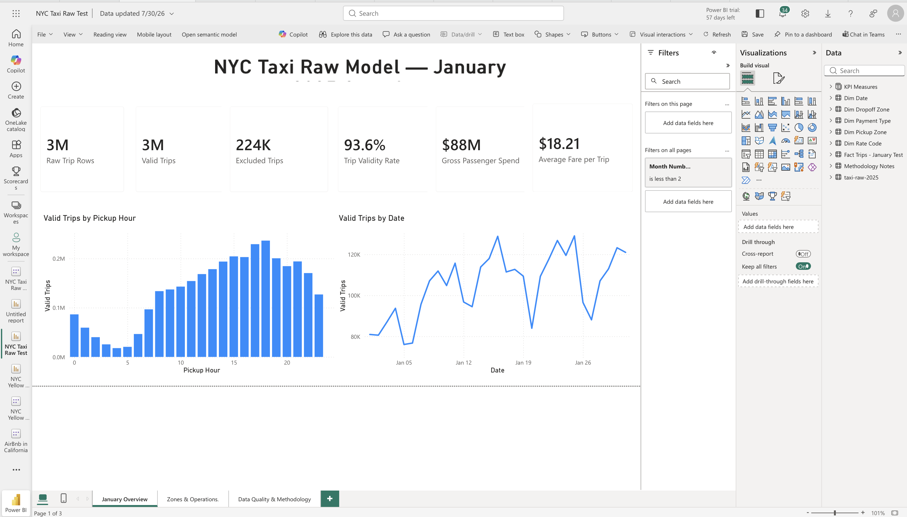

# NYC Taxi Operations — January 2025

**Explore where and when New York's yellow taxis were busy, and how much passengers spent.**

I used **3.48 million trip records** from the NYC Taxi and Limousine Commission (TLC) to build a three-page Power BI report for **January 2025**. Each record describes one trip, including its time, pickup and drop-off locations, distance, fare and payment details.

The aim is to help someone reviewing taxi operations understand the activity behind the totals: busy times, popular locations and spending. First, I separated the records included in the analysis from those excluded by the project's data-quality classification.

**[Open the three-page report PDF](artifacts/NYC%20Taxi%20Raw%20Test.pdf)** — available without a Power BI account.

## The result in plain language

- **3.25 million trips were included in the main analysis** — about 94 out of every 100 January records.
- **224,106 records were excluded from the main calculations**, but kept visible in the quality summary so the totals can be checked.
- Included trips recorded **about $88 million in passenger spending** and an **average fare of $18.21**.
- The location charts highlight busy areas, including **Midtown Center** and the **Upper East Side**; the time charts show how activity changes by hour and date.

The spending figure describes recorded passenger payments, not taxi-company profit. All findings cover **January 2025 only**.

## Follow the story through the report

| Page | What it helps you understand |
|---|---|
| **1. January Overview** | How many trips were recorded, how much passengers spent, and when trips happened |
| **2. Zones & Operations** | Which pickup and drop-off areas were busiest, and how people paid |
| **3. Data Quality & Methodology** | Which records were included, which were excluded, and whether the counts add up |

For example, an operations reviewer can start with the hourly pattern, look at the busy pickup areas, and then check which records were included. These views describe observed trips; they do not establish how many taxis should be assigned to a location.

## What I did

1. **Brought in the source data.** Loaded the January trip file and a lookup that translates location numbers into place names.
2. **Organized it for analysis.** Connected trips to dates, pickup and drop-off areas, payment types and fare categories.
3. **Made the calculations consistent.** Used the included-trip population for spending, fares and operational comparisons, while keeping excluded records visible in the audit.
4. **Built the report.** Created the three pages in Power BI and documented the calculations and scope.

The technical tools were **Power Query** for loading and preparing data, **DAX** for reusable calculations, and **Power BI** for the model and report. The source files were loaded from **Azure Blob Storage**. [Read the model and measure definitions](docs/model-and-measures.md).

## How I checked the totals

| January records | Exact count |
|---|---:|
| Included in the main analysis, labeled “Valid” | 3,251,098 |
| Excluded from the main analysis | 224,106 |
| Total January records | **3,475,204** |

**3,251,098 + 224,106 = 3,475,204.** The included share is **93.55%**; the excluded share is **6.45%**. “Valid” is the project's classification, not a guarantee that every field is error-free.

A February 1 boundary record is kept outside the January report. Missing fare-category labels remain visible so a reader can see where the source has gaps. [Read the data-quality notes](docs/data-quality-methodology.md).

## Explore the work

- [Three-page report PDF](artifacts/NYC%20Taxi%20Raw%20Test.pdf)
- [Zones and operations preview](screenshots/02-zones-and-operations.png) · [Data-quality preview](screenshots/03-data-quality-methodology.png)
- [Data sources and preparation steps](docs/data-sources-and-pipeline.md)
- [Model and calculations](docs/model-and-measures.md) · [Model diagram](screenshots/04-semantic-model.png) · [Power Query preview](screenshots/05-power-query-pipeline.png)
- [Report reading guide](docs/report-guide.md) · [Project summary](docs/portfolio-summary.md)
- [PowerPoint presentation](https://arizonastateu-my.sharepoint.com/:p:/g/personal/spabitwa_sundevils_asu_edu/IQAmjewK6ftXRoBg1DYv-YpfARJt2VfS_PyPVFOjSAb091w?e=DOMgNl) — may require an ASU/Microsoft account; use the PDF above for public review.

**Source:** [Official NYC TLC trip records](https://www.nyc.gov/site/tlc/about/tlc-trip-record-data.page), using `yellow_tripdata_2025-01.parquet` and `taxi_zone_lookup.csv`.

This repository contains the report PDF, screenshots and documentation. It does not include a public interactive Power BI link, the editable `.pbix` file or the raw trip files. The findings describe the included yellow-taxi records, not all travel in New York. Extending the report to later months is future work.

Built by **Shashank Pabitwar** · Power BI, Power Query and DAX · Historical public data
